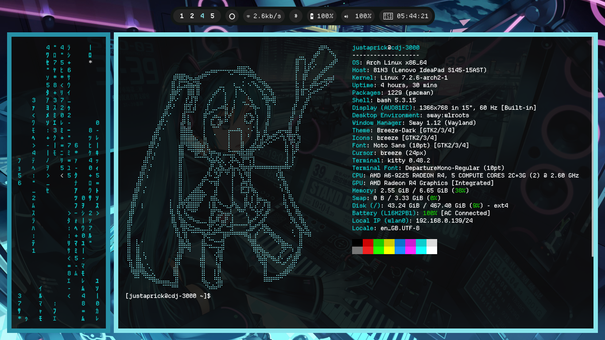

# Arch Miku Rice

A simple Hatsune Miku-themed Sway rice for Arch Linux.
```bash
⠀⠀⠀⠀⠀⠀⠀⠀⠀⠀⠀⠀⠀⠀⠀⠀⠀⠀⠀⠀⠀⠀⠀⠀⠀⠀⠀⠀⠀⠀⠀⠀⠀⠀⠀⠀⠀⠀⠀⠀⠀⠀⠀⠀⠀⠀⠀⠀⠀⠀⠀  ⠀⢠⣶⠶⣄⠀⠀
⠀⠀⠀⠀⠀⠀⠀⠀⠀⠀⠀⠀⠀⠀⠀⠀⠀⠀⠀⠀⠀⠀⠀⠀⠀⠀⠀⠀⠀⠀⠀⠀⠀⠀⠀⠀⠀⠀⠀⠀⠀⠀⠀⠀⠀⠀⠀⠀⠀⣀⡀⠀⠀⣴⠟⠀⠀⠈⠳⡄
⠀⠀⠀⠀⠀⠀⠀⠀⠀⠀⠀⠀⠀⠀⠀⠀⠀⠀⠀⠀⠀⠀⠀⠀⠀⠀⠀⠀⠀⠀⠀⠀⠀⠀⠀⠀⠀⠀⠀⠀⠀⠀⠀⠀⠀⠀⠀⠀⣿⠉⢹⢀⡼⢃⠀⠀⠀⢀⣴⠟
⠀⠀⠀⠀⠀⠀⠀⠀⠀⠀⠀⠀⠀⠀⠀⠀⠀⠀⠀⠀⠀⠀⢀⣀⣤⣤⠤⠤⠤⡤⢤⣼⣿⣿⣝⣦⡀⠀⠀⠀⠀⠀⠀⠀⠀⠀⠀⠀⡿⠀⢸⡼⠑⠁⠀⣠⡾⠋⠁⠀
⠀⠀⠀⠀⠀⠀⠀⠀⠀⠀⠀⠀⠀⢰⡿⣿⣟⡶⣤⣠⣴⠾⠛⠉⠀⠀⠀⠀⠀⠈⠁⠀⠉⠩⠙⠛⠿⣤⡀⠀⠀⠀⠀⠀⠀⠀⠀⠀⡇⠀⣿⠃⠀⣠⡾⠋⣀⣤⣴⠀
⠀⠀⠀⠀⠀⠀⠀⠀⠀⠀⠀⠀⠀⣿⢀⣏⣩⣽⣶⡭⣿⠂⠀⠀⠀⠀⢀⣀⠀⠀⠰⣀⡀⠅⠐⠌⠳⣌⠙⢷⣄⠀⠀⠀⠀⠀⠀⠀⣗⠀⡇⠀⣴⠿⠖⣋⠽⠊⠁⠀
⠀⠀⠀⠀⠀⠀⠀⠀⠀⠀⠀⠀⢀⣿⡾⡋⠀⢸⣿⡇⣿⠀⠀⠀⢀⡴⠋⠘⡄⠀⠀⡇⠙⠢⡀⠀⠀⠈⢳⣁⠙⣧⠀⠀⠀⠀⠀⠀⣿⢸⡏⢑⡥⠖⠋⠁⠀⠀⠀⠀
⠀⠀⠀⠀⠀⠀⠀⠀⠀⠀⠀⠀⣸⠟⠔⠀⠀⡞⣸⢹⠇⠀⠀⢠⠎⠀⠀⠀⡇⠀⢠⠁⠀⣀⠘⢦⠀⠀⠐⢻⡷⢾⡇⠀⠀⠀⠀⠀⡿⠀⢀⡾⠁⠀⠀⠀⠀⠀⠀⠀
⠀⠀⠀⠀⠀⠀⠀⠀⠀⠀⠀⣰⠟⠜⠀⠀⢸⣟⡏⣼⠀⠀⢀⡏⢀⣀⠤⠶⣯⠀⡼⠀⠀⠈⠉⠚⢷⠤⠀⠈⣷⠀⠁⠀⠀⠀⠀⣼⠃⢀⡾⠁⠀⠀⠀⠀⠀⠀⠀⠀
⠀⠀⠀⠀⠀⠀⠀⠀⠀⠀⣰⠟⠔⠀⠀⠀⣾⢩⠉⠁⠀⠀⣾⠚⢉⣤⣀⠀⡟⡴⠁⠀⠀⢠⠖⢦⡘⡄⠀⠀⣿⠀⠀⠀⠀⠀⢀⡟⠀⣼⠁⠀⠀⠀⠀⠀⠀⠀⠀⠀
⠀⠀⠀⠀⠀⠀⠀⠀⠀⣰⡟⡐⠀⠀⠀⢠⡿⢸⡄⠀⠀⠀⡇⠀⣏⡀⣹⠆⠛⠀⠀⠀⠀⠘⠦⠞⠁⡇⠀⢠⡇⠀⠀⠀⠀⠀⣼⠁⢰⠇⠀⠀⠀⠀⠀⠀⠀⠀⠀⠀
⠀⠀⠀⠀⠀⠀⠀⠀⣰⡟⠐⠀⠀⠀⠀⢸⣿⣾⣧⠀⠀⠀⡇⠀⠈⠉⠁⠀⠀⡤⠤⠴⢦⠀⠐⠠⠁⣇⠀⣼⠀⠀⢀⣤⠤⣤⣿⠀⡿⠀⠀⠀⠀⠀⠀⠀⠀⠀⠀⠀
⠀⠀⠀⠀⠀⠀⠀⢰⡿⢡⠀⠀⠀⠀⠀⢸⣿⣿⣿⣦⡀⠀⣧⠀⠀⠁⠀⠀⠀⡇⠀⠀⢸⠀⠘⠀⢀⡟⣰⢋⡷⢞⡫⠔⢳⡘⣟⣟⠹⡆⠀⠀⠀⠀⠀⠀⠀⠀⠀⠀
⠀⠀⠀⠀⠀⠀⢠⣿⢃⠆⠀⠀⠀⠀⠀⣼⡟⢿⣿⣿⣿⣦⡟⡆⠀⠀⠀⠀⠀⡇⠀⠀⢸⡇⠀⣠⣞⣤⣟⠍⠊⠁⠀⠀⠀⣧⠘⡍⣾⠁⠀⠀⠀⠀⠀⠀⠀⠀⠀⠀
⠀⠀⠀⠀⠀⠀⣾⠇⡄⠀⠀⠀⠀⠀⠀⣿⡇⠈⠙⢻⡿⠛⣆⠹⡶⠦⣤⢀⣀⣓⣒⠲⣾⣗⣿⣿⠋⠈⠀⠀⠀⠀⠀⠀⠀⢻⠀⡷⠋⠀⠀⠀⠀⠀⠀⠀⠀⠀⠀⠀
⠀⠀⠀⠀⠀⣼⡏⠘⠀⠀⠀⠀⠀⠀⠀⣿⠁⠀⠀⠈⠉⠉⠉⠳⣵⡼⣕⢄⠀⡨⡯⢦⡈⡟⠛⡍⡇⠀⠀⠀⠀⠀⠀⠀⠀⣸⠀⡏⠀⠀⠀⠀⠀⠀⠀⠀⠀⠀⠀⠀
⠀⠀⠀⠀⢰⡿⢀⠃⠀⠀⠀⠀⠀⠀⠀⣿⠀⠀⠀⠀⠀⠀⠀⢠⡟⡠⣜⣦⣁⡼⣦⢤⡻⣷⢶⡷⠳⠶⠶⠶⠶⠶⠶⣶⠶⠿⠖⠁⠀⠀⠀⠀⠀⠀⠀⠀⠀⠀⠀⠀
⠀⠀⠀⢀⣿⠃⡄⠀⠀⠀⠀⠀⠀⠀⠀⣿⠀⠀⠀⠀⠀⠀⣠⠻⠄⣙⡼⠁⠙⠁⡿⠀⢳⡘⢿⡇⠀⠀⠀⠀⠀⠀⠰⣹⣇⠀⠀⠀⠀⠀⠀⠀⠀⠀⠀⠀⠀⠀⠀⠀
⠀⠀⠀⣼⡏⠀⠀⠀⠀⠀⠀⠀⠀⠀⠀⣿⠀⠀⠀⠀⢀⣼⠋⠑⠖⣶⡇⠀⠀⠀⡇⠀⢠⠷⡞⣇⠀⠀⠀⠀⠀⠀⠀⢁⢹⣆⠀⠀⠀⠀⠀⠀⠀⠀⠀⠀⠀⠀⠀⠀
⠀⠀⢰⡿⠀⡌⠀⠀⠀⠀⠀⠀⠀⠀⠀⣿⠀⠀⢀⣴⣿⣥⡀⠀⠀⣼⠀⠀⠀⠀⡇⠀⢸⣋⣹⠹⣦⡀⠀⠀⠀⠀⠀⠈⠆⢻⡄⠀⠀⠀⠀⠀⠀⠀⠀⠀⠀⠀⠀⠀
⠀⠀⣿⠇⠀⠀⠀⠀⠀⠀⠀⠀⢀⠀⠀⣿⢀⣴⢿⣿⣿⣿⠋⠀⣶⣯⡀⠀⠀⠀⡇⠀⠀⢠⡇⢰⠁⣧⣄⣀⠀⠀⠀⠀⢸⡀⢿⡄⠀⠀⠀⠀⠀⠀⠀⠀⠀⠀⠀⠀
⠀⢸⡿⠀⢰⠀⠀⠀⠀⠀⠀⠀⢸⠀⢠⡟⡟⣽⣿⣿⡿⠁⠀⢸⢸⣇⠙⠢⢤⣠⠟⣦⡀⢸⠟⣎⢠⠋⢀⠏⣿⠀⠀⠀⠘⣧⠈⢿⣄⠀⠀⠀⠀⠀⠀⠀⠀⠀⠀⠀
⠀⣾⠇⠀⠀⠀⠀⠀⠀⠀⠀⠀⠸⣇⠸⣆⠸⣌⠙⠛⠁⠀⠀⠀⣿⠋⣛⡦⣤⡼⡀⠈⠛⠋⡄⠈⠑⣗⢏⣰⠏⠀⠀⠀⠀⠘⣧⠀⢿⣆⠀⠀⠀⠀⠀⠀⠀⠀⠀⠀
⢠⣿⠀⠀⠀⠀⠀⠀⠀⠀⠀⠀⠀⣿⡀⢻⣦⡈⠛⠦⣤⣀⣀⢸⣧⡼⠏⣤⡟⢀⡇⠀⠀⠀⢸⡤⠚⢁⣴⠏⠀⠀⠀⠀⠀⠀⢘⢷⡀⢻⣆⠀⠀⠀⠀⠀⠀⠀⠀⠀
⢸⡏⠀⠀⠀⠀⠀⠀⠀⠀⠀⠀⠀⠘⣧⠘⣿⢯⣓⣢⣤⣀⣀⣹⡋⣌⣵⠋⠑⢚⡏⠉⠉⠉⣁⣷⠞⢉⠼⡻⣦⡀⠀⠀⠀⠀⠀⡀⠻⣦⡹⣆⠀⠀⠀⠀⠀⠀⠀⠀
⢸⡇⠀⠀⠀⠀⠀⠀⠀⠀⠀⠀⠀⠀⠹⣇⢹⡇⠈⠉⠉⠙⡷⣛⠚⠋⠉⢹⡿⠟⠛⠛⠛⠻⢧⡆⢰⠃⠀⠉⠙⢿⣦⣄⠀⠀⠀⠡⠀⣿⠙⠻⠇⠀⠀⠀⠀⠀⠀⠀
⢸⡇⠀⣇⠐⠀⠀⠀⠀⠀⠀⠀⠀⠀⠀⣿⣧⣻⡄⠀⠀⢸⣧⣈⡉⠒⠒⣻⠀⠀⠀⠀⠀⠀⠈⢻⣿⣀⠀⠀⠀⠀⠑⠟⣷⣤⣀⠀⠀⣿⠀⠀⠀⠀⠀⠀⠀⠀⠀⠀
⢸⡇⠀⣿⠀⡀⠀⠀⠀⠀⠀⠀⠀⠀⢀⣿⡏⠙⠇⠀⠀⢸⡇⠈⠉⢉⣯⡟⠀⠀⠀⠀⠀⠀⠀⠀⢿⣟⢷⣄⡀⠀⠀⢀⡽⠋⠉⠆⣸⡏⠀⠀⠀⠀⠀⠀⠀⠀⠀⠀
⢸⣇⠀⣿⡄⠱⠀⠀⠀⠀⠀⠀⠀⠀⣼⡿⠀⠀⠀⠀⠀⣼⡇⠀⠀⢱⢻⡇⠀⠀⠀⠀⠀⠀⠀⠀⠀⢻⣮⣯⠛⢶⣄⡞⠄⢠⠞⣰⡿⠁⠀⠀⠀⠀⠀⠀⠀⠀⠀⠀
⠀⢿⡀⣿⣷⡀⢂⠀⠀⠀⠀⠀⠀⢀⣿⠃⠀⠀⠀⠀⠀⢿⡇⠀⠀⠘⣾⠀⠀⠀⠀⠀⠀⠀⠀⠀⠀⠀⠙⣿⠀⠀⠈⠉⠚⢁⣴⡿⠁⠀⠀⠀⠀⠀⠀⠀⠀⠀⠀⠀
⠀⠘⢿⣿⠻⣷⣄⡡⡀⠀⠀⠀⠀⢸⣿⠀⠀⠀⠀⠀⠀⢸⡇⠀⠀⡇⡟⠀⠀⠀⠀⠀⠀⠀⠀⠀⠀⠀⠀⣿⠀⠀⢀⣠⣴⡿⠋⠀⠀⠀⠀⠀⠀⠀⠀⠀⠀⠀⠀⠀
⠀⠀⠈⠉⠀⠈⠙⠻⢷⣦⣤⣤⣄⣀⣿⠀⠀⠀⠀⠀⠀⠸⣧⣀⠀⢛⣿⡄⠀⠀⠀⠀⠀⠀⠀⠀⠀⠀⠀⠿⠿⠟⠛⠋⠁⠀⠀⠀⠀⠀⠀⠀⠀⠀⠀⠀⠀⠀⠀⠀
⠀⠀⠀⠀⠀⠀⠀⠀⠀⠀⠈⠉⠉⠛⠛⠀⠀⠀⠀⠀⠀⠀⠈⠳⠾⠶⠛⠁⠀⠀⠀⠀⠀⠀⠀⠀⠀⠀⠀⠀⠀⠀⠀⠀⠀⠀⠀⠀⠀⠀⠀⠀⠀⠀⠀⠀⠀⠀⠀⠀
```

## Screenshots

### Desktop


### Terminal



## Setup

- **OS:** Arch Linux
- **Compositor:** Sway
- **Bar:** Waybar
- **Launcher:** Wofi
- **Terminal:** Kitty
- **Shell:** Bash
- **File Manager:** Nautilus
- **GTK Theme:** Breeze Dark
- **Font:** Departure Mono
- **System Info:** Fastfetch

## Dotfiles

The repository is managed with [GNU Stow](https://www.gnu.org/software/stow/).

Clone the repository:

```bash
git clone https://github.com/JhonDoeNut/Arch-Miku-Rice.git ~/dotfiles
cd ~/dotfiles
```

Install the required packages:

```bash
sudo pacman -S --needed - < packages/rice-packages.txt
```

Install the AUR packages with `yay`:

```bash
yay -S --needed - < packages/rice-aur.txt
```

Apply the dotfiles:

```bash
stow bash fastfetch fonts gtk-3.0 gtk-4.0 kitty nwg-look sway waybar wofi xsettingsd
```

Refresh the font cache:

```bash
fc-cache -fv
```

Then start or reload Sway.

## Notes


This rice was inspired in part by **diinki**, please check out her work here:

- [diinki-retrofuture repository](https://github.com/diinki/diinki-retrofuture/tree/main)
- [Linux & Theming - The Ultimate Guide](https://www.youtube.com/watch?v=jFz5gLqv-FM)

The included wallpaper is stored at:

```text
sway/.config/sway/wallpapers/43.jpg
```

The rice also includes the **Departure Mono** font.

Full package snapshots:

```text
packages/pacman.txt
packages/aur.txt
```

Rice-specific package lists:

```text
packages/rice-packages.txt
packages/rice-aur.txt
```

```⠀⠀⠀⠀⠀⠀⠀⠀⠀⠀⠀⠀⠀⠀⠀⠀⠀⠀⠀⠀⠀⠀⠀⠀⠀⠀⠀⠀⠀⠀⠀⠀⠀⠀⠀⠀⠀⠀⠀⠀⠀⠀⠀⠀⠀⠀⣀⣀⣤⣤⣤⣴⣦⣶⣤⣤⣀⣀⣤⣤⣄⡀⠀⠀⠀⠀⠀⠀⠀⠀⠀⠀⠀⠀⠀⠀⠀⠀⠀⠀⠀⠀⠀⠀⠀⠀⠀⠀⠀⠀⠀⠀⠀⠀⠀⠀⠀⠀⠀⠀
⠀⠀⠀⠀⠀⠀⠀⠀⠀⠀⠀⠀⠀⠀⠀⠀⠀⠀⠀⠀⠀⠀⠀⠀⠀⠀⠀⠀⠀⠀⢀⣴⣾⠿⠿⣶⣦⣄⡀⠀⢀⣠⣴⣶⠿⠿⠛⠋⠉⠉⠉⠉⠀⠀⠈⠉⠛⠋⠉⠉⠙⠻⣷⣦⡀⠀⠀⠀⠀⠀⠀⠀⠀⠀⠀⠀⠀⠀⠀⠀⠀⠀⠀⠀⠀⠀⠀⠀⠀⠀⠀⠀⠀⠀⠀⠀⠀⠀⠀⠀
⠀⠀⠀⠀⠀⠀⠀⠀⠀⠀⠀⠀⠀⠀⠀⠀⠀⠀⠀⠀⠀⠀⠀⠀⠀⠀⠀⠀⠀⣠⣿⠏⠀⣠⣄⡀⠈⠙⣿⡾⠟⠋⠁⢀⣀⡤⠶⠖⠛⠛⠲⠞⠋⠉⠛⠛⠒⠲⢿⣷⣦⣄⠀⠉⠻⣷⣶⣤⣄⣀⠀⠀⠀⠀⠀⠀⠀⠀⠀⠀⠀⠀⠀⠀⠀⠀⠀⠀⠀⠀⠀⠀⠀⠀⠀⠀⠀⠀⠀⠀
⠀⠀⠀⠀⠀⠀⠀⠀⠀⠀⠀⠀⠀⠀⠀⠀⠀⠀⠀⠀⠀⠀⣀⣤⣴⣶⡶⠾⠾⠿⠃⢀⣼⣿⣻⣿⡏⠀⠉⣀⣤⠶⠞⠉⢁⠠⠀⠄⡒⠀⠄⠂⠌⢀⠡⠐⠀⠀⠀⠈⠙⢿⣿⣦⣀⠀⠀⠈⠙⠻⣷⣄⠀⠀⠀⠀⠀⠀⠀⠀⠀⠀⠀⠀⠀⠀⠀⠀⠀⠀⠀⠀⠀⠀⠀⠀⠀⠀⠀⠀
⠀⠀⠀⠀⠀⠀⠀⠀⠀⠀⠀⠀⠀⠀⠀⠀⠀⠀⠀⠀⢀⣼⡿⠟⠃⠀⣀⣀⡀⠀⠀⣼⡿⣧⣿⣿⠇⢀⡼⠛⠀⠀⡀⠘⢀⠀⠄⢠⠃⠠⢀⠘⠀⠄⠀⠄⡀⠀⠀⠀⠀⠀⠸⢿⣿⣧⡀⠛⢧⡀⠘⢿⣧⠀⠀⠀⠀⠀⠀⠀⠀⠀⠀⠀⠀⠀⠀⠀⠀⠀⠀⠀⠀⠀⠀⠀⠀⠀⠀⠀
⠀⠀⠀⠀⠀⠀⠀⠀⠀⠀⠀⠀⠀⠀⠀⠀⠀⠀⠀⣴⡿⠋⠀⡠⠞⠋⠀⠀⠀⢀⣾⣿⣽⣿⣿⡿⣿⠋⠀⠄⠂⢁⠠⠈⡀⠄⢈⡏⢀⠐⠠⠀⡁⠂⢁⠠⠀⠀⠀⠀⢀⠀⡀⠈⠹⣟⣿⣦⠀⢻⡄⠈⢿⣧⠀⠀⠀⠀⠀⠀⠀⠀⠀⠀⠀⠀⠀⠀⠀⠀⠀⠀⠀⠀⠀⠀⠀⠀⠀⠀
⠀⠀⠀⠀⠀⠀⠀⠀⠀⠀⠀⠀⠀⠀⠀⠀⠀⠀⣼⡟⠀⣠⠞⠀⡀⠀⠀⠀⠀⣾⣿⣳⣿⡿⢃⡾⠁⠀⠀⠂⢈⠀⢄⠞⠀⡐⣘⠀⠄⠂⠠⠁⡀⠌⠀⠀⠀⠀⠀⠀⠀⠁⠀⠐⡀⠙⣿⣿⠀⡀⢿⠀⠈⣿⡄⠀⠀⠀⠀⠀⠀⠀⠀⠀⠀⠀⠀⠀⠀⠀⠀⠀⠀⠀⠀⠀⠀⠀⠀⠀
⠀⠀⠀⠀⠀⠀⠀⠀⠀⠀⠀⠀⠀⠀⠀⠀⠀⣼⡟⠀⢰⢏⣾⣿⣶⣎⣠⣤⣼⣿⣿⣿⡿⠁⣼⠃⠀⠀⠀⠀⠀⣀⡞⠀⡐⠀⣷⠀⠀⢈⠀⠐⠀⣄⠀⠀⠀⠀⠀⠀⠀⠀⠀⢂⠠⠀⠸⡟⢀⠐⣸⡇⠀⣿⡇⠀⠀⠀⠀⠀⠀⠀⠀⠀⠀⠀⠀⠀⠀⠀⠀⠀⠀⠀⠀⠀⠀⠀⠀⠀
⠀⠀⠀⠀⠀⠀⠀⠀⠀⠀⠀⠀⠀⠀⠀⠀⢀⣿⠃⢀⣿⣾⣿⣿⣿⣿⣿⣿⢿⣿⣿⣿⢃⢰⡇⠀⠀⠀⠀⠀⠀⡼⠀⠀⠄⠂⣽⣄⠀⠀⠀⢀⠀⠙⠧⣄⠀⠠⠀⠄⢀⠠⠐⠀⡀⢧⡐⠀⢂⠰⢸⡇⠀⣿⡇⠀⠀⠀⠀⠀⠀⠀⠀⠀⠀⠀⠀⠀⠀⠀⠀⠀⠀⠀⠀⠀⠀⠀⠀⠀
⠀⠀⠀⠀⠀⠀⠀⠀⠀⠀⠀⠀⢀⣀⣄⣀⣼⡟⠀⣸⣟⣿⣽⣿⣟⠻⢿⣿⣼⣿⣿⣿⢊⣼⢡⠀⠀⠀⠀⠀⣸⠇⠀⠀⠐⢀⡇⠸⣦⡀⢈⠀⠀⠀⣇⠈⠛⣦⣐⠈⠀⠄⠂⡐⠀⡀⢧⠐⡀⢎⣹⠇⠀⣿⡇⠀⠀⠀⠀⠀⠀⠀⠀⠀⠀⠀⠀⠀⠀⠀⠀⠀⠀⠀⠀⠀⠀⠀⠀⠀
⠀⠀⠀⠀⠀⠀⠀⠀⠀⠀⣠⣾⣿⣿⣿⣿⠿⡷⡟⠿⢋⠿⢿⡿⠛⠀⢀⣼⠟⢸⣿⣿⢥⡟⣿⠀⠀⠀⠀⣰⠏⠀⡀⠄⠀⣸⠁⠀⡼⣿⣦⡀⠡⠀⠹⡄⠀⠀⠽⢷⣌⠀⠂⠄⠂⡀⠘⡄⠸⣄⢻⠀⠀⣿⡇⠀⠀⠀⠀⠀⠀⠀⠀⠀⠀⠀⠀⠀⠀⠀⠀⠀⠀⠀⠀⠀⠀⠀⠀⠀
⠀⠀⠀⠀⠀⠀⠀⠀⠀⣰⣿⣿⣿⣿⣿⣧⣛⠴⣩⠝⡊⠅⠀⠀⠀⣠⣿⠟⠀⣼⣿⣿⡎⣽⣿⠀⠀⠠⣱⠏⠀⢂⢠⠀⢠⣿⣀⡀⠀⠜⣿⣷⣦⡐⠀⢻⡄⠀⠀⣹⣿⣷⣅⠐⠠⢀⠁⡸⢐⠬⣻⠀⠀⣿⡇⠀⠀⠀⠀⠀⠀⠀⠀⠀⠀⠀⠀⠀⠀⠀⠀⠀⠀⠀⠀⠀⠀⠀⠀⠀
⠀⠀⠀⠀⠀⢀⣠⣶⡿⣿⣿⣿⣿⣿⣿⣿⣿⣧⠗⡌⠀⠀⠀⣠⣾⣿⠋⠀⢸⡇⠀⢸⣷⣾⣿⠇⠀⢡⡟⠀⠌⠀⡎⠀⣼⠋⠈⠉⠓⠲⢿⣿⣿⣿⣄⠈⣧⠀⠚⠁⠺⣹⢿⣷⡆⡄⢂⡘⡇⢎⣽⠀⠀⣿⡇⠀⠀⠀⠀⠀⠀⠀⠀⠀⠀⠀⠀⠀⠀⠀⠀⠀⠀⠀⠀⠀⠀⠀⠀⠀
⠀⠀⠀⣠⣶⣿⣿⣿⣿⣿⣿⣿⣿⣿⣭⣛⢩⠁⠀⠀⠀⣠⣾⣿⡟⠁⠀⣰⣾⡇⠀⠈⣿⣿⣿⠁⢨⡿⠁⠐⠠⢁⡇⢐⣿⠀⠀⣄⠀⠀⠈⢻⣿⣿⣿⣇⢾⡇⠀⠀⣀⣼⣿⣿⣿⣷⢆⡜⣹⢂⣿⡄⠀⣿⡇⠀⠀⠀⠀⠀⠀⠀⠀⠀⠀⠀⠀⠀⠀⠀⠀⠀⠀⠀⠀⠀⠀⠀⠀⠀
⠀⢀⣾⣿⣿⣿⣿⣿⣿⣿⣿⣿⣿⣟⢿⣿⣷⣄⠀⢀⣴⣿⡿⠋⠀⣰⣴⣿⣿⣻⡶⢤⣼⣿⡿⢀⣿⠃⢀⠁⠂⢸⣧⢨⣿⣿⣶⣦⣄⠀⠀⠀⠻⣿⣿⣿⣿⡇⢠⣾⣿⣿⡽⢿⣿⣿⣿⡜⣳⠐⣾⡇⠀⣿⡇⠀⠀⠀⠀⠀⠀⠀⠀⠀⠀⠀⠀⠀⠀⠀⠀⠀⠀⠀⠀⠀⠀⠀⠀⠀
⢀⣾⣿⣿⣿⣿⣿⣿⣿⣿⣟⣛⠻⢿⣷⣝⢿⣿⣧⣾⣿⠟⠁⠀⠀⣿⣿⣿⣋⣼⣷⡛⡟⠿⣿⣼⣟⠀⠤⠈⢀⣿⣿⣸⣿⣿⡟⣻⠝⢧⠀⠀⠀⠈⠻⣿⣿⢷⣿⣿⣿⣼⡇⠈⣿⣿⣿⣞⠱⠈⣾⡇⠀⢻⡇⠀⠀⠀⠀⠀⠀⠀⠀⠀⠀⠀⠀⠀⠀⠀⠀⠀⠀⠀⠀⠀⠀⠀⠀⠀
⢸⣿⣿⣿⣿⣿⢿⣿⣿⣿⣿⣿⣷⣤⠙⣿⣧⢿⣿⣿⠃⠀⡀⠀⠀⣿⡟⣿⣧⣿⣿⣿⣼⢲⡌⡽⣿⣤⠀⢂⢰⣿⣿⣿⠿⡿⠛⣿⠄⠀⠀⠀⠀⠀⠀⠈⠹⠎⢯⣙⠉⣸⠃⠸⢫⣿⣿⣯⠆⠁⢾⡇⠀⢸⡇⠀⠀⠀⠀⠀⠀⠀⠀⠀⠀⠀⠀⠀⠀⠀⠀⠀⠀⠀⠀⠀⠀⠀⠀⠀
⢸⣿⣿⣿⣿⡏⣼⣿⣿⣿⣿⣿⣿⣿⣇⠸⣿⣾⣿⡇⠀⠠⠆⣠⣼⣿⢀⣿⣿⣿⣿⣿⣿⣿⣼⠡⠎⠻⣿⣤⣼⡗⠻⠻⠦⣤⠴⠏⠀⠀⠀⠀⠀⠀⠀⠀⠀⠀⠀⠛⠛⠁⠀⠀⣾⠘⣿⠛⡇⢈⢚⡇⠀⢸⣯⠀⠀⠀⠀⠀⠀⠀⠀⠀⠀⠀⠀⠀⠀⠀⠀⠀⠀⠀⠀⠀⠀⠀⠀⠀
⢸⣿⣿⣿⣿⡅⣿⣿⣿⣿⣿⣿⣿⣿⣿⠀⣿⣿⣿⡇⠀⢸⣿⣿⢿⣧⣼⣿⣿⣿⣿⣿⣿⣿⣿⣧⠉⠋⠙⠙⢻⣇⠀⠀⠀⠀⠀⠀⠀⠀⠀⠀⠀⠀⠀⠀⠀⠀⠀⠀⠀⠀⠀⢸⡇⠀⡁⠠⠁⠂⡸⣿⠀⢸⣿⠀⠀⠀⠀⠀⠀⠀⠀⠀⠀⠀⠀⠀⠀⠀⠀⠀⠀⠀⠀⠀⠀⠀⠀⠀
⢸⣿⣿⡽⣿⣧⠹⣿⣿⣿⣿⣿⣿⣿⠏⣼⣿⣽⣿⡇⣰⠏⢸⣿⣾⣿⣿⣿⣿⣿⣿⣿⣿⡿⢛⠷⠈⠀⠀⠀⠀⠹⣧⡀⠀⠀⠀⠀⠀⠀⠀⠀⠀⠀⠀⠁⠀⠀⠀⠀⠀⠀⢤⣿⡇⠐⠀⡁⠄⢁⠰⣿⠀⠈⣿⡀⠀⠀⠀⠀⠀⠀⠀⠀⠀⠀⠀⠀⠀⠀⠀⠀⠀⠀⠀⠀⠀⠀⠀⠀
⠘⢿⣿⣿⣿⣿⣷⣬⣙⡛⠿⣻⣿⣫⣾⣿⣏⣿⣿⡶⠋⣰⣿⣿⣿⣿⣿⣿⣿⣿⣿⣿⣿⠁⠃⠀⠀⠀⠀⠀⠀⢠⣿⣟⣳⣄⠀⠀⠀⠀⠀⠠⣴⣶⣶⣶⣾⠗⠀⠀⠀⣴⣿⣿⣿⠀⠂⠠⠐⢀⠐⣿⠀⠀⣿⡇⠀⠀⠀⠀⠀⠀⠀⠀⠀⠀⠀⠀⠀⠀⠀⠀⠀⠀⠀⠀⠀⠀⠀⠀
⠀⠀⠻⣿⣼⣿⣿⣿⣿⣿⣿⣿⣿⢿⣿⣿⣿⢿⠏⠀⣴⢿⡝⠁⠈⠉⠙⢿⣿⣿⣿⣿⣟⠀⠀⠀⠀⠀⠀⠀⣀⣼⣯⣿⡟⠻⣷⣄⡀⠀⠀⠀⠈⠉⠉⠉⠁⠀⢀⣴⣾⣿⣿⣿⣿⡇⠀⡁⠐⡀⠂⣽⡇⠀⢿⡇⠀⠀⠀⠀⠀⠀⠀⠀⠀⠀⠀⠀⠀⠀⠀⠀⠀⠀⠀⠀⠀⠀⠀⠀
⠀⠀⠐⣿⡧⣿⡿⢿⣻⣯⡿⣿⣯⣿⣾⢧⡟⠃⢠⣼⡟⡎⠀⠉⠉⠙⠛⠳⡞⣿⣿⣿⡇⠀⢀⣤⣤⣀⠀⣴⣿⡿⠟⠉⠙⢦⣽⣿⠿⢦⣤⣀⠀⠀⠀⠀⣰⠛⢻⣿⣿⣿⣿⣿⣿⣷⠀⠄⢁⠠⠐⡸⡇⠀⢸⡇⠀⠀⠀⠀⠀⠀⠀⠀⠀⠀⠀⠀⠀⠀⠀⠀⠀⠀⠀⠀⠀⠀⠀⠀
⠀⠀⠀⣿⣷⣉⣿⣿⣿⣿⣿⣶⡝⣷⢿⣾⠃⣠⣾⣿⢇⡟⢀⡀⠐⠀⠀⠀⣇⢸⣿⣿⠇⠐⠋⠀⠀⢘⣿⡿⠋⠀⣠⡆⠀⣾⡟⣿⣿⣾⣿⣿⣿⣷⣾⣿⢿⡇⢸⣿⣿⣿⣿⣿⣿⡿⠀⢈⠀⠄⠂⠱⣿⠀⢸⣿⠀⠀⠀⠀⠀⠀⠀⠀⠀⠀⠀⠀⠀⠀⠀⠀⠀⠀⠀⠀⠀⠀⠀⠀
⠀⠀⠀⣿⣿⣿⣟⣿⣿⣿⣿⣿⣿⢸⣿⣿⢠⣿⣿⣿⢸⣷⡸⢿⣦⣄⠀⣰⣇⣾⣿⣿⠂⠈⡀⠀⠀⣸⠋⠀⣠⣾⠟⠀⢠⡟⠻⠿⠛⠋⠀⠉⠉⠙⠿⠿⣦⡁⢿⣿⣿⣿⣿⣿⣿⡇⠀⢂⠀⠂⠌⠐⣿⠀⠘⣿⡀⠀⠀⠀⠀⠀⠀⠀⠀⠀⠀⠀⠀⠀⠀⠀⠀⠀⠀⠀⠀⠀⠀⠀
⠀⠀⠀⣽⣿⣿⣿⢹⣿⣿⣿⣿⡿⣸⣿⣏⣾⣿⣿⡯⣾⡿⠷⢮⣽⣿⣶⣿⠿⠻⡉⠟⣶⣀⠑⠤⠀⡿⠲⣶⡿⠋⠀⣀⠾⠁⠀⠀⠀⠀⠀⠀⠀⢰⡤⠴⠟⢧⡌⠻⢿⣿⣿⣿⣿⠃⠀⠌⠐⡀⠄⠐⣻⡀⠀⣿⡇⠀⠀⠀⠀⠀⠀⠀⠀⠀⠀⠀⠀⠀⠀⠀⠀⠀⠀⠀⠀⠀⠀⠀
⠀⠀⠠⣿⣿⣯⠻⣷⣍⣛⣛⢻⣴⣿⠟⣱⣿⣿⣿⣿⡿⠁⠀⠀⠀⠀⠀⠀⠠⣅⣜⠠⠙⣿⣶⣄⣼⢧⡀⠈⠀⣀⣾⣟⣓⠂⠄⠀⠀⠀⠀⠀⠀⠘⠷⣤⣀⢨⡿⢷⣤⡈⠛⠛⠉⠋⠻⠶⣶⣦⣄⠂⢹⡇⠀⢿⣇⠀⠀⠀⠀⠀⠀⠀⠀⠀⠀⠀⠀⠀⠀⠀⠀⠀⠀⠀⠀⠀⠀⠀
⠀⠀⠀⢻⣿⣿⣷⣮⣙⡛⢛⢻⣻⣥⣿⣿⣿⣿⠟⠛⠁⠀⠀⠀⠀⠀⠀⠀⠀⠀⠈⠁⣠⣿⣿⣿⣿⡄⠙⣄⠚⠉⠁⠀⠉⠙⣆⠈⠐⠠⠀⠀⠀⠀⠀⠈⢷⡄⠘⢦⡉⠉⠳⢦⡙⢦⠀⠀⠀⠉⠺⡛⢶⣿⠀⢸⣿⠀⠀⠀⠀⠀⠀⠀⠀⠀⠀⠀⠀⠀⠀⠀⠀⠀⠀⠀⠀⠀⠀⠀
⠀⠀⠀⠀⣿⣿⣿⣿⣿⣿⣿⣿⣿⣿⣿⣿⡿⢁⠠⢠⠀⡄⢠⠀⠠⢀⠀⠀⠀⠀⠀⢀⡞⠙⣿⣿⣿⣿⡄⠹⡆⠀⠀⠀⠀⠀⢯⡁⠀⠀⠀⠀⠀⠀⠀⠀⠀⢻⡄⢀⠳⣤⠀⠀⠁⠈⠳⡀⠀⠀⠀⠈⢢⡻⡄⠸⣿⣄⠀⠀⠀⠀⠀⠀⠀⠀⠀⠀⠀⠀⠀⠀⠀⠀⠀⠀⠀⠀⠀⠀
⠀⠀⠀⠀⣿⣿⣿⣿⣿⣿⣿⣿⣿⣿⣿⣿⣿⣤⢃⠦⣡⠒⠤⠘⠠⠀⠀⠀⠀⣀⣤⠟⠁⢸⣿⣿⣿⣿⣿⡀⢹⡄⠀⠀⠀⠀⠩⠀⠀⠀⠀⠀⠀⠀⠀⠀⠀⠈⢻⣆⠀⡈⠳⣄⠀⠀⠀⠙⢦⡀⡀⠀⠀⠙⣇⠀⠈⢻⡿⢿⣦⣄⠀⠀⠀⠀⠀⠀⠀⠀⠀⠀⠀⠀⠀⠀⠀⠀⠀⠀
⠀⠀⠀⠀⣿⣿⣿⣿⣿⣿⣿⣿⣿⣿⣿⣿⣿⡿⠿⠿⠶⠿⠾⠷⠷⠶⠾⠟⠛⠉⠁⠀⡘⣿⣿⣿⣿⣿⣿⡇⠘⣧⠀⠀⠀⠀⢸⠂⠀⠀⠀⠀⠀⠀⠀⠀⠀⠀⠈⠻⣧⡀⠐⠘⢷⣄⠉⠦⠿⣇⠁⠀⠀⠀⠈⠳⢦⣀⣧⡀⠈⠻⣷⡄⠀⠀⠀⠀⠀⠀⠀⠀⠀⠀⠀⠀⠀⠀⠀⠀
⠀⠀⠀⠀⢻⣿⣿⣿⣿⣿⣿⣿⣿⣿⣿⣿⣿⡼⢅⠂⠀⠀⠀⠀⠀⠀⠀⠀⠀⠀⠀⠐⣼⣿⣿⣿⣿⣿⣿⡿⢀⣿⠀⠀⠀⠀⢠⡁⠀⠀⠀⠀⠀⠀⠀⠀⠀⠀⠀⠀⠹⣷⡈⢀⠂⠙⢿⡶⠶⠿⠶⢦⡀⠀⠀⠀⠀⠀⠙⣿⣦⠀⠙⣿⣦⠀⠀⠀⠀⠀⠀⠀⠀⠀⠀⠀⠀⠀⠀⠀
⠀⠀⠀⠀⠈⢿⣿⣿⣿⣿⣿⣿⣿⣿⣿⣿⣿⣷⣈⠰⢠⢂⠠⢀⡀⠀⠀⠀⠀⠀⢀⣡⣿⣿⣿⣿⣿⣿⣿⡇⢸⡇⠀⠀⠀⠀⢸⡇⠀⡄⠀⠀⠀⠀⠀⠀⠀⠀⠀⠀⠀⠘⣿⡆⠠⠁⡈⠱⡆⠀⠀⠲⣕⡀⠀⠀⠀⠀⢀⡟⣿⣷⡀⠈⠻⣷⣄⠀⠀⠀⠀⠀⠀⠀⠀⠀⠀⠀⠀⠀
⠀⠀⠀⠀⠀⠀⠹⣿⣿⣿⣿⣿⣿⣿⣿⣿⣿⣿⢦⡙⡆⢬⡑⢢⠠⣉⣄⣠⡴⠞⠋⣿⣿⣿⣿⣿⣿⣿⡟⠀⡾⠀⠀⠀⠀⠀⣼⠄⢰⡇⠀⠀⠀⠀⠀⠀⠀⠀⠀⠀⠀⠀⠹⣿⡀⠐⡀⠁⠹⡄⠀⠀⠘⢿⡄⠀⠀⣠⡾⢁⣿⣿⣿⣦⡀⠨⠻⣷⣄⠀⠀⠀⠀⠀⠀⠀⠀⠀⠀⠀
⠀⠀⠀⠀⠀⠀⠀⠈⣿⠛⣿⣿⣿⣿⡟⡟⠛⠛⠛⠿⠛⠿⠛⠛⠟⠛⠉⠁⠠⣄⣾⣿⣿⣿⣿⣿⣿⡟⠁⣼⠁⠀⠀⠀⠀⢸⡏⠀⣾⠀⠀⠀⠀⠀⠀⠀⠀⠀⠀⠀⠀⠀⠀⣿⡇⠠⢀⠁⠂⢿⠀⠀⠀⠀⣿⣦⡾⢋⣴⣿⣿⣿⣿⣿⣿⣦⡀⠈⠻⣷⣄⠀⠀⠀⠀⠀⠀⠀⠀⠀
⠀⠀⠀⠀⠀⠀⠀⢸⣿⠀⣘⣿⣿⣿⣿⡱⠡⠌⢂⣄⡀⠀⠄⢂⡀⠀⠀⠄⣱⣾⣿⣿⣿⣿⣿⡿⠋⣠⢾⡇⠀⠀⠀⠀⢠⣞⢁⣸⠇⠀⠀⠀⠀⠀⠀⠀⠀⠀⠀⠀⠀⠀⠀⢸⡇⠐⡀⠈⠄⡘⣇⠀⠀⠀⣿⣷⣿⣿⣿⣿⣿⣿⣿⣿⣿⣿⣿⣦⡀⠈⢻⣧⠀⠀⠀⠀⠀⠀⠀⠀
⠀⠀⠀⠀⠀⠀⠀⢸⡏⠀⢹⣿⣿⣿⣿⣇⠻⣌⠲⣌⠷⢬⠐⠠⢀⠂⣀⣴⣿⣿⣿⣿⠿⠛⢁⣤⠞⠁⠈⣿⣄⠀⠀⢀⣾⠇⣼⠋⠀⠀⠀⠀⠀⠀⠀⠀⠀⠀⠀⠀⠀⠀⠀⢸⡇⠐⡀⠡⠀⠄⢿⠀⠀⠀⢹⣿⣿⣿⣿⣿⣿⣿⣿⣿⣿⣿⣿⣿⣿⡀⠈⣿⡆⠀⠀⠀⠀⠀⠀⠀
⠀⠀⠀⠀⠀⠀⠀⣿⡇⠀⡿⠈⠻⣿⡿⢿⢷⣾⣿⣾⣽⣦⣭⣶⠟⠛⠛⠛⠛⢉⣉⣠⡴⠞⠋⠀⣠⣶⡀⠘⢿⣦⣶⡿⠋⠚⠛⠓⠀⠀⠀⠀⠀⠀⠀⠀⠀⠀⠀⠀⠀⠀⠀⢨⡗⠠⠐⠀⠡⠀⢼⡆⠀⠀⢹⣿⡏⢹⣿⣿⣿⣿⣿⣿⣿⣿⣿⣿⣿⠀⢰⣿⠁⠀⠀⠀⠀⠀⠀⠀
⠀⠀⠀⠀⠀⠀⢰⣿⠀⢰⡇⠠⢀⠀⢀⠀⠀⠀⠀⠀⠙⢿⣿⣿⣿⣿⣿⣾⠛⠛⠉⠁⣀⣤⣶⠿⠛⠻⣿⡀⠸⣿⡿⡖⠒⠂⠀⠀⠀⠀⠀⠀⠀⠀⠀⠀⠀⠀⠀⠀⠀⠀⠀⢸⡇⢀⠂⢁⠂⢁⠀⣧⠀⠀⠸⣿⢿⣿⣿⣿⣿⣿⣿⣿⣿⣿⣿⣿⠇⠀⣼⡏⠀⠀⠀⠀⠀⠀⠀⠀
⠀⠀⠀⠀⠀⠀⣸⡏⠀⣸⠀⠠⠀⠌⠀⠠⠈⢀⠐⠀⠂⠀⠈⠉⢉⣿⣿⣿⠀⢰⣾⠿⠛⠉⠀⠀⠀⠀⢿⣧⠀⢸⣷⣷⠀⠠⠀⠀⠀⠀⠀⠀⠀⠀⠀⠀⠀⠀⠀⠀⠀⠀⠀⠘⣇⠀⡐⠠⠐⠀⢂⢻⠀⠀⢸⣿⣿⣿⠟⣻⣿⣿⣿⣻⡟⣿⣿⡟⠀⢸⣿⠀⠀⠀⠀⠀⠀⠀⠀⠀
⠀⠀⠀⠀⠀⠀⣿⡇⠀⣿⠀⡀⢁⠂⠈⠀⠄⠂⠀⠌⠀⠁⠀⠀⣾⣿⣿⣿⠀⠈⣿⠄⠀⠀⠀⠀⠀⠀⠩⣿⣆⠀⢻⣿⡆⠀⠀⠀⠀⠀⠀⠀⠀⠀⠀⠀⠀⠀⠀⠀⠀⠀⠀⠀⣿⠀⠠⠐⡀⠡⢀⢸⡆⠀⢸⣿⣿⣥⣿⣿⣿⣿⣿⣿⡿⠈⣿⠀⢠⣿⠃⠀⠀⠀⠀⠀⠀⠀⠀⠀
⠀⠀⠀⠀⠀⢀⣿⠀⢰⡇⠀⠄⡀⠂⢁⠀⠂⢀⠐⠀⣈⣤⣄⣾⣿⣿⣿⣿⡄⠀⣿⡇⠀⠀⠀⠀⠀⠀⠀⠸⣿⡄⠈⢿⣧⠤⠀⠀⠄⠀⠀⠀⠀⠀⠀⠀⠀⠀⠀⠀⠀⠀⠀⠀⣿⠀⠡⠐⢀⠐⡀⠈⣷⠀⢸⣿⣿⣿⣿⣿⣿⣿⡿⡿⠁⣰⠇⠀⣾⡏⠀⠀⠀⠀⠀⠀⠀⠀⠀⠀
⠀⠀⠀⠀⠀⣸⡟⠀⢸⠃⢀⠂⠠⠐⠀⡀⠌⠀⠀⠄⣾⣿⣿⣿⢿⣿⣿⣿⡇⠀⢻⡇⠀⠀⠀⠀⠀⠀⠀⠀⢻⣷⡀⠘⣿⣆⠀⢀⠠⠐⠂⠀⠀⠀⠀⠀⠀⠀⠀⠀⠀⠀⠀⠀⣿⡅⠂⢈⠠⠀⠄⡁⠸⡆⢸⣿⣿⣿⣿⣿⣿⡿⢱⣇⣀⡟⠀⣼⡿⠀⠀⠀⠀⠀⠀⠀⠀⠀⠀⠀
⠀⠀⠀⠀⠀⣿⡇⠀⡿⠀⠠⠀⡁⢀⠂⠀⠠⠐⠈⠀⣿⣿⣿⣯⣿⣿⣿⣿⡇⠀⢸⡇⠀⠀⠀⠀⠀⠀⠀⠀⠀⢿⣧⠀⢹⣿⡄⠀⡄⠀⠀⠀⠀⠀⠀⠀⠀⠀⠀⠀⠀⠀⠀⠀⣿⡇⠀⢂⠠⠈⡀⠄⠁⢿⣻⣿⣿⣿⣿⣿⡿⢠⣟⣼⡿⠁⢰⣿⠁⠀⠀⠀⠀⠀⠀⠀⠀⠀⠀⠀
⠀⠀⠀⠀⢠⣿⠀⢰⡇⠀⡁⠠⠐⠀⠀⠀⠂⠀⠄⣠⣿⣿⣿⣟⣿⣿⣿⣿⣿⠀⢸⣿⠀⠀⠀⠀⠀⠀⠀⠀⠀⠘⣿⡄⠀⢻⣧⠀⠀⡄⠀⠀⠀⠀⠀⠀⠀⠀⠀⠀⠀⠀⠀⠀⣻⣇⠈⡀⠄⠂⡀⠂⢁⠘⣿⣿⣿⣿⣿⣿⣥⡟⡴⣼⠃⢀⣿⡇⠀⠀⠀⠀⠀⠀⠀⠀⠀⠀⠀⠀
⠀⠀⠀⠀⢸⣿⠀⢸⡇⠀⡄⠐⢠⠀⠁⠀⡄⣴⣾⣿⣿⣿⣿⣿⢻⣿⣿⣿⣿⠀⢸⣿⠀⠀⠀⠀⠀⠀⠀⠀⠀⠀⢹⣿⡄⠈⣿⡆⠀⢠⠀⠀⠀⠀⠀⠀⠀⠀⠀⠀⠀⠀⠀⠀⢹⣿⠀⡄⠂⠁⢠⠈⢠⠀⢹⣿⣿⣿⢻⣿⣾⢳⢳⡏⠀⣼⡟⠀⠀⠀⠀⠀⠀⠀⠀⠀⠀⠀⠀⠀
⠀⠀⠀⢀⣾⡇⠀⣾⣄⣀⣄⣐⣀⣀⣀⣠⣾⣿⣿⣿⣿⣿⣷⣿⣿⣿⣿⣿⣿⡀⢸⣿⣠⠀⠀⠀⠀⠀⠀⠀⠀⠀⢀⣿⣧⠀⣹⣿⣤⣀⣀⣀⣀⣀⣀⣀⡀⠀⠀⠀⠀⠀⣀⣀⣸⣿⣀⣠⣔⣈⣤⣐⣀⣈⣀⣈⣹⣿⣿⣾⣷⣏⣾⠁⣠⣿⡃⠀⠀⠀⠀⠀⠀⠀
⠀⠀⠀⠀⠀⠀
have fun :3
```
